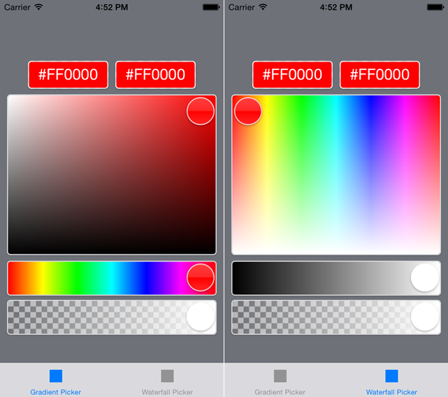

# DLColorPicker

**DLColorPicker** is a loose collection of **UIControls**…

* `DLCPHexPicker`
* `DLCPHuePicker`
* `DLCPBrightnessPicker`
* `DLCPAlphaPicker`
* `DLCPSaturationBrightnessPicker`
* `DLCPHueSaturationPicker`
**DLColorPicker** uses **no image files**, but instead renders them **efficiently** via `CAGradientLayer`s.

As each one of the pickers isn't that usefull on its own, **DLColorPicker** also includes a pair of **UIViewControllers**:

* `DLCPGradientColorPickerController` (as seen on the left in the preview)
* `DLCPWaterfallColorPickerController` (as seen on the right in the preview)

Don't want a hex picker? No problem: Just don't add it to your view then. ;) Same for alpha, etc.

## Preview

## Features

* **Six picker controls** to choose from.
* **Two picker controllers** to choose from.
* **No image resources required**.
* **Animates** on color change.
* **Custom layout** (frames, sizes, positions, etc)
* **Custom appearance** (borders, shadows, etc.)

## Installation

Just copy the files in `"DLColorPicker/Classes/..."` into your project.

(I don't use CocoaPod myself, but am very open for pull requests for a pod!)

## Demos

**DLColorPicker** contains a demo app giving you a quick overview of both included controllers.

## ARC

**DLColorPicker** uses **automatic reference counting (ARC)**.

## Dependencies

None.

## Creator

Vincent Esche ([@regexident](http://twitter.com/regexident))

## License

**DLColorPicker** is available under a **modified BSD-3 clause license** with the **additional requirement of attribution**. (**DLColorPicker** further more includes code by InfinitApps LLC, licensed under the **MIT license**.) See the `LICENSE` file for more info.